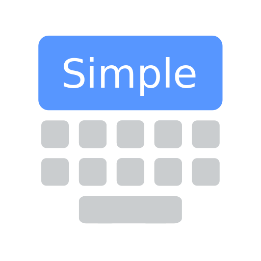

# Simple Keyboard

## About

Features:
- Small size (~1MB)
- Adjustable keyboard height for more screen space
- Number row
- Swipe space to move pointer
- Delete swipe
- Custom theme colors
- Minimal permissions (only Vibrate)
- Ads-free

Feature it doesn't have and probably will never have:
- Emojis
- GIFs
- Spell checker
- Swipe typing

## Screenshots

## Downloads

## Credits

Licensed under Apache License Version 2

- [Simple Keyboard](https://github.com/rkkr/simple-keyboard)
- [AOSP LatinIME](https://android.googlesource.com/platform/packages/inputmethods/LatinIME)
